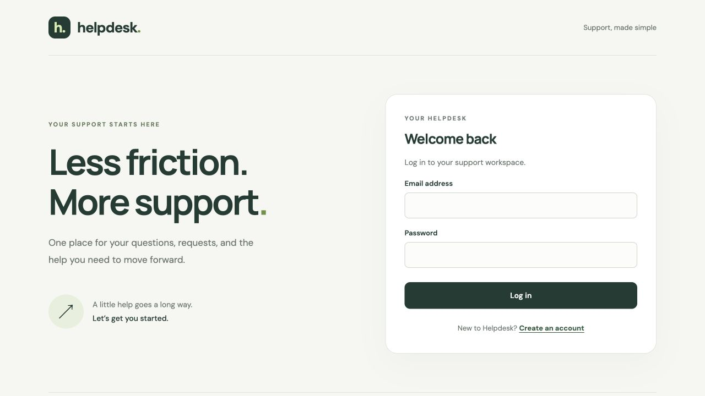
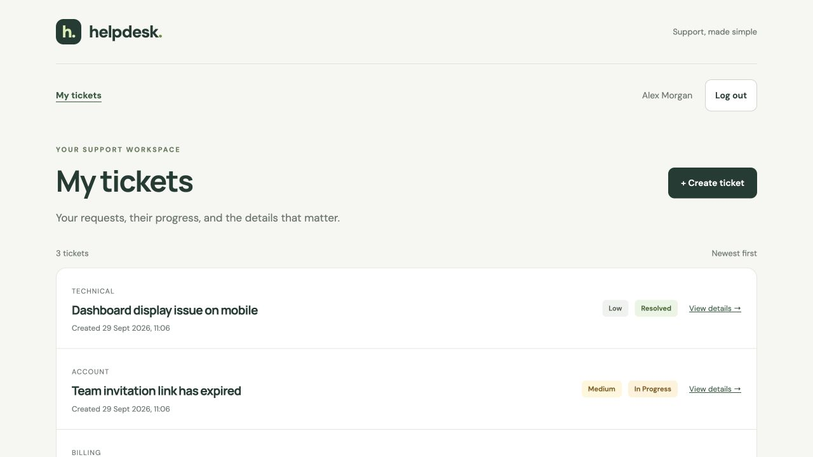
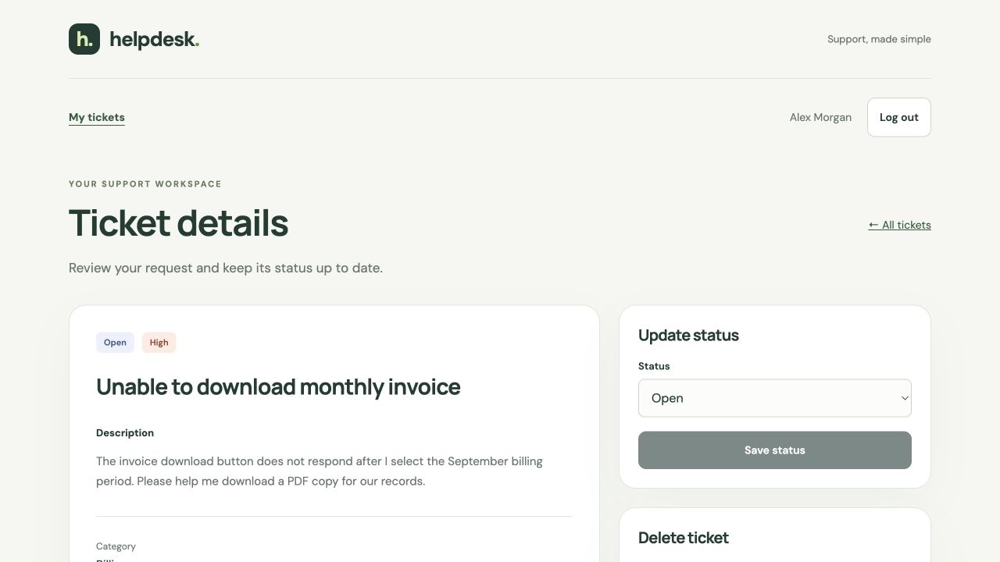
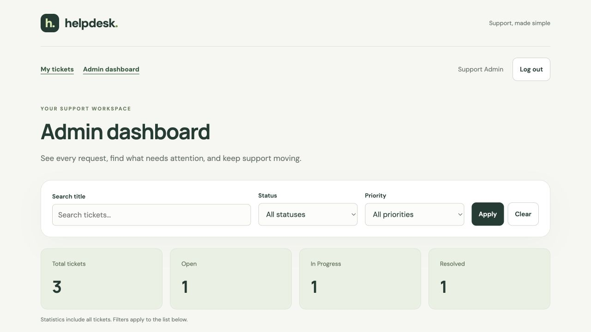

# Mini Helpdesk & Support Ticket System

A full-stack support portal built for a technical assessment. Users can register, sign in, create tickets, track their status, and delete their own tickets. Administrators can review all tickets, search and filter them, update statuses, and view ticket statistics.

**Repository:** https://github.com/priya2001/helpdesk-ticket-system

**Submission mode:** local application with local MongoDB. A working public deployment is not included. Deployment configuration is optional and requires additional setup.

## Features

- Registration, login, logout, protected pages, and persistent sessions.
- Password hashing with bcrypt; JWT stored in an HttpOnly cookie, with server-side session revocation.
- Owner-scoped ticket creation, pagination, details, status updates, and deletion.
- Admin dashboard with title search, status/priority filters, and global ticket counts.
- Responsive layouts, form validation, loading indicators, empty states, and error/retry states.
- Backend authorization, input validation, authentication rate limiting, and security headers.

## Tech stack

React 19, React Router, Vite, CSS, Node.js 24, Express 5, MongoDB, Mongoose, bcrypt, JSON Web Tokens, and Node's built-in test runner. The repository uses npm workspaces (`client` and `server`).

## Run locally

### 1. Prerequisites and dependencies

Install Node.js **24.x** (with npm) and MongoDB Community Server. MongoDB must be running locally; MongoDB Compass alone is a database client, not the database server.

```sh
git clone https://github.com/priya2001/helpdesk-ticket-system.git
cd helpdesk-ticket-system
npm ci
```

### 2. Start MongoDB

If MongoDB is already running on `127.0.0.1:27017`, keep using that instance. Otherwise, with `mongod` installed and available in your terminal:

```sh
mkdir -p "$HOME/.local/share/helpdesk-mongodb"
mongod --dbpath "$HOME/.local/share/helpdesk-mongodb" --bind_ip 127.0.0.1 --port 27017
```

Keep this terminal open. This local setup binds MongoDB to the loopback interface. No cloud database is required.

### 3. Configure the backend

Copy the example on first setup only; do not overwrite an existing `.env`:

```sh
cp server/.env.example server/.env
node -e "console.log(require('node:crypto').randomBytes(48).toString('hex'))"
```

Paste the generated random string as `JWT_SECRET` in `server/.env`:

```dotenv
MONGODB_URI=mongodb://127.0.0.1:27017/helpdesk_ticket_system
JWT_SECRET=PASTE_YOUR_GENERATED_RANDOM_SECRET_HERE
APP_ORIGIN=http://127.0.0.1:5173
NODE_ENV=development
```

| Variable | Purpose |
| --- | --- |
| `MONGODB_URI` | Local database connection string. |
| `JWT_SECRET` | Random secret of at least 32 characters; never commit it. |
| `APP_ORIGIN` | Exact frontend origin, without a trailing slash. |
| `NODE_ENV` | Use `development` for the local HTTP setup. |
| `PORT` | Optional backend port; defaults to `4000`. |
| `HOST` | Optional bind address; defaults to `127.0.0.1` locally. |
| `TRUST_PROXY_HOPS` | Defaults to `0`; leave unchanged locally. |

The frontend needs no `.env` for local development. Vite forwards `/api` requests to port `4000`.

MongoDB creates the application database and collections as data is written. Mongoose initializes the model indexes at startup; no SQL schema, migration, or seed command is required. Collections store users, tickets, and sessions. Tickets reference their owner, and session documents support expiry/revocation.

### 4. Start the application

From the repository root, in a separate terminal:

```sh
npm run dev
```

This starts both frontend and backend. Open **http://127.0.0.1:5173**. Use this exact address to match `APP_ORIGIN`.

- Backend health: http://127.0.0.1:4000/api/health
- Database readiness: http://127.0.0.1:4000/api/ready

Register an account to begin. There are no built-in credentials or preloaded tickets.

If you prefer two terminals, run `npm run dev --workspace=server` and `npm run dev --workspace=client` instead of the root command. Do not run both approaches together. The client uses `npm run dev`, not `npm start`.

### 5. Create an administrator

Register the intended account first, then run this command from the repository root, replacing the email:

```sh
npm run make-admin --workspace=server -- your-registered-email@example.com
```

Log out and log back in using that account's existing password. The admin dashboard is available at `/admin`. The command promotes an existing account; it does not create an account or reset its password. Public registration always creates a regular user.

## API

All routes use the `/api` prefix. Request bodies use JSON. Authentication is cookie-based; API clients must retain the session cookie. Frontend requests are same-origin through Vite's proxy.

| Method | Endpoint | Access / behavior |
| --- | --- | --- |
| GET | `/api/health` | Process health. |
| GET | `/api/ready` | Database readiness; returns 503 when unavailable. |
| POST | `/api/auth/register` | Register and sign in; `name`, `email`, `password`, `confirmPassword`. |
| POST | `/api/auth/login` | Sign in with `email`, `password`. |
| POST | `/api/auth/logout` | Revoke current session and clear cookie. |
| GET | `/api/auth/me` | Retrieve authenticated user's profile and role. |
| POST | `/api/tickets` | Create own ticket. |
| GET | `/api/tickets?page=1` | List own tickets, 20 per page. |
| GET | `/api/tickets/:id` | Retrieve own ticket. |
| PATCH | `/api/tickets/:id` | Update own ticket's `status`. |
| DELETE | `/api/tickets/:id` | Permanently delete own ticket. |
| GET | `/api/admin/tickets` | Admin-only list, filters, pagination, and global statistics. |
| PATCH | `/api/admin/tickets/:id` | Admin-only status update for any ticket. |

Create-ticket example:

```json
{
  "title": "Unable to download invoice",
  "description": "The invoice download button does not respond after selecting a billing period.",
  "category": "Billing",
  "priority": "Medium"
}
```

Status-update example:

```json
{ "status": "In Progress" }
```

Admin query example: `/api/admin/tickets?search=invoice&status=Open&priority=High&page=1`. Filters combine with AND; title search is literal and case-insensitive. Statistics describe all tickets, independent of active filters.

- Categories: `Technical`, `Billing`, `Account`, `Other`.
- Priorities: `Low`, `Medium`, `High`; default `Medium`.
- Statuses: `Open`, `In Progress`, `Resolved`; new tickets start `Open`.
- Title: 3–150 characters; description: 10–5,000 characters.
- Password: at least 8 characters, at most 72 UTF-8 bytes.
- Owner, role, timestamps, and initial ticket status are controlled by the server.
- Ticket update endpoints accept only `status`; title/description editing is outside this implementation.
- Common error statuses: 400 validation, 401 unauthenticated, 403 unauthorized, 404 missing/inaccessible ticket, 409 duplicate email, 429 rate limit, 503 database unavailable.

User management is registration and authenticated profile retrieval, with a local CLI for administrator provisioning. General user-edit/delete administration is not included.

## Screenshots

These screenshots use fictional demo records in an isolated local database.

### Sign in



### User tickets



### Ticket details



### Admin dashboard



## Verification

```sh
npm test
npm run test:integration
npm run build
```

Integration tests require local MongoDB at `127.0.0.1:27017`. They use temporary `helpdesk_test_*` databases and clean them up; they do not use the application's `.env` database. See [testing notes and manual acceptance checklist](docs/TESTING.md).

Suggested reviewer flow: register → create ticket → update status → refresh → cancel and confirm deletion of a disposable ticket → promote an account → log in as admin → test combined filters and statistics → log out and confirm protected-page redirection.

## Troubleshooting

- **Port already in use / EADDRINUSE:** a previous copy may already be running. Open the frontend URL first, or stop the earlier dev process with Ctrl+C before restarting. Do not start duplicate servers.
- **MongoDB connection failed:** start local MongoDB and check the URI/port. The readiness endpoint should report a connected database.
- **Login or write request rejected:** use `127.0.0.1`, match `APP_ORIGIN`, and keep `NODE_ENV=development` locally. Production secure cookies require HTTPS.
- **Invalid JWT secret:** replace the example value with the generated random string.
- **Admin access denied:** register the account, promote the same email, and sign in again.

## Structure and implementation notes

- `client/src/pages`: authentication, ticket, and admin screens.
- `client/src/auth`: authentication state.
- `server/src/routes`: REST endpoints and authorization.
- `server/src/models`: users, tickets, and sessions.
- `server/src/validation`: request validation rules.
- `server/scripts/make-admin.js`: explicit admin provisioning.
- `server/test` and `client/test`: automated checks.

Ticket ownership is enforced by database queries, not only by UI controls. The server reads the user's current role, and logout revokes the stored session. Password hashes are excluded from normal model output. Write requests have origin checks; production cookies are Secure and local cookies are HttpOnly/SameSite=Lax.

This assessment intentionally omits email verification, password reset, attachments, and notifications. Deletion is permanent. Authentication rate limits are stored in process memory; multi-instance production deployments would need a shared rate-limit store.

## Optional deployment

See [Render + Vercel deployment instructions](docs/DEPLOYMENT.md) only if a public deployment is required later. The current submission is local. Render cannot reach your laptop's MongoDB through `127.0.0.1`: that address refers to the Render server itself. Public deployment needs a database reachable from the backend. The Vercel backend destination remains a placeholder and must be configured before deployment.
